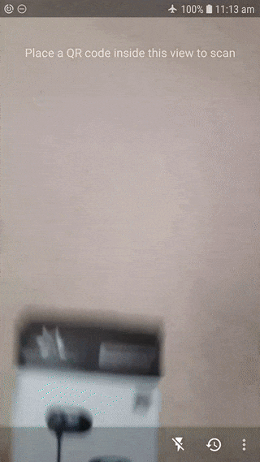

# QR-Reader-Android
A robust, minimalist QR code reader for Android powered by [Google Vision Barcode API](https://developers.google.com/vision/android/barcodes-overview).

## Demo

## Functions

- Open in browser, web search or copy scanned QR code
- Option to directly open scanned QR code in the browser
- Ability to use torch/flasher to scan in dark places
- Save scan history with time and date
- Delete individual items from scan history and undo mistaken deletions
- Display corners of the decoded QR code in real-time

## Prerequisites

Android API 21 (Android 5.0 - Lollipop) or greater

## How to setup

Clone or [download](https://github.com/amila93/QR-Reader-Android/archive/master.zip) the repository and open "**QRScanner**" project using Android Studio.

## Note

Google Play Services will automatically download and install required dependencies on the first run of this app. If the app is not detecting any QR code, then turn on Wifi or Mobile Data on your device and wait a couple of minutes. This is a one time process.
