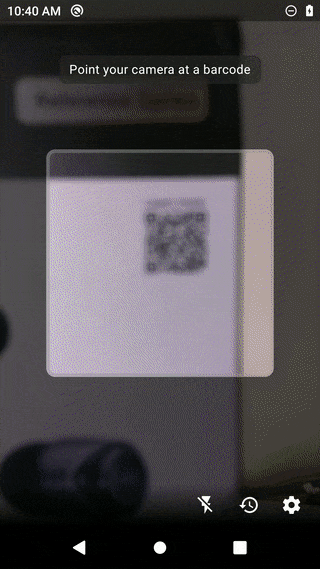

# QR-Reader-Android
Minimalistic QR Code Reader for Android (Using Google Vision Barcode API)  

This project is still in development phase. Goal is to build a robust, useful QR code reader using the power of Google Vision Barcode API.

## Demo

## Prerequisites

- Android API 24 (Nougat) or greater

## How to setup

- Clone or download the repo and open "QRScanner" project using Android Studio.

## Note

- Google Play Services will automatically download and install required dependencies on the first run of this app. If the app is not detecting any QR code, then turn on Wifi or Mobile Data on your device and then reinstall the app.
